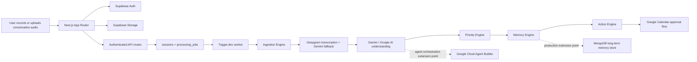

# Vynora

Vynora is an open-source conversation intelligence app built with Next.js, Supabase, Trigger.dev, Deepgram, Gemini/Google AI, and Google Calendar. It turns recorded conversations into transcripts, structured memory, priority signals, and approval-based follow-up actions.

For the current build status and recent shipped work, see [PROJECT_STATUS.md](./PROJECT_STATUS.md).

## Backend Loop

```txt
Audio upload
→ Supabase Storage
→ sessions + processing_jobs
→ Trigger.dev worker
→ Ingestion Engine
→ Transcription Engine
→ Understanding Engine
→ Priority Engine
→ Memory Engine
→ Action Engine
→ approval-based Google Calendar event creation
```

## Architecture



## Features

- Audio upload with Supabase Storage-backed session tracking.
- Deepgram-first transcription, Gemini transcription fallback, and Gemini structured conversation extraction.
- Six-engine processing pipeline for ingestion, transcription, understanding, priority, memory, and actions.
- Memory graph/profile updates across conversations.
- Approval-based Google Calendar action suggestions.
- Privacy controls for memory export and deletion.

## Six Intelligence Engines

The backend is organized under `src/lib/intelligence` so each engine has one job:

- `ingestion`: validates uploaded audio, normalizes source metadata, and prepares session storage paths.
- `transcription`: produces raw and cleaned transcript layers without overwriting source truth.
- `understanding`: turns transcript text into validated semantic extraction.
- `priority`: scores what deserves attention and writes clarity-first session insights.
- `memory`: evolves person profiles, compressed summaries, and graph edges across conversations.
- `actions`: suggests external tool actions while keeping execution approval-based.

## Tech Stack

- Next.js App Router
- Supabase Auth, Database, and Storage
- Trigger.dev workers
- Deepgram
- Google Gemini / Google AI
- Google Calendar API
- Vitest

## Hackathon Infrastructure Alignment

The current MVP keeps its working Next.js, Supabase, Trigger.dev, Deepgram, Gemini/Google AI, and Google Calendar implementation intact. The repository also documents how MongoDB and Google Cloud Agent Builder fit into the production architecture without forcing a framework or backend rewrite during the hackathon window.

### MongoDB Integration Path

MongoDB is the intended document-oriented persistence layer for production conversation intelligence artifacts that benefit from flexible schemas:

- normalized conversation summaries
- long-term memory profiles
- memory edges and relationship snapshots
- extracted action context
- agent-readable user preferences

In the current build, these records are represented through the existing Supabase-backed MVP schema. A production MongoDB adapter can be introduced at the Memory Engine boundary, allowing the app to keep Supabase Auth and Storage while persisting high-volume intelligence documents in MongoDB.

### Google Cloud Agent Builder Integration Path

Google Cloud Agent Builder is the intended orchestration layer for production agent experiences. It can sit after the Understanding Engine, where transcript context has already been cleaned, structured, and validated.

The integration point is designed around:

- grounding agent responses in extracted conversation memory
- routing follow-up suggestions through approval-based tool actions
- connecting Google workspace actions, including Calendar, through a controlled agent layer
- preserving the current human-in-the-loop approval model before external actions execute

## Setup

1. Copy `.env.example` to `.env.local`.
2. Fill Supabase, Trigger.dev, Google OAuth, Google AI, optional MongoDB / Google Cloud Agent Builder, and `ENCRYPTION_KEY` values locally.
3. Apply the Supabase migrations in order, including `20260511072226_resona_backend_mvp.sql` and `20260514073454_six_engine_intelligence.sql`.
4. Install dependencies:

```bash
npm install
```

5. Run the app and worker:

```bash
npm run dev
npm run trigger:dev
```

## Environment Variables

Use `.env.example` as the public template. Do not commit `.env`, `.env.local`, `.env.production`, or any other secret-bearing environment file.

```txt
NEXT_PUBLIC_SUPABASE_URL=
NEXT_PUBLIC_SUPABASE_ANON_KEY=
SUPABASE_SERVICE_ROLE_KEY=
ENCRYPTION_KEY=
TRIGGER_SECRET_KEY=
TRIGGER_PROJECT_ID=
GOOGLE_CLIENT_ID=
GOOGLE_CLIENT_SECRET=
GOOGLE_REDIRECT_URI=
GOOGLE_AI_API_KEY=
DEEPGRAM_API_KEY=
GOOGLE_CLOUD_PROJECT_ID=
MONGODB_URI=
GOOGLE_AGENT_BUILDER_APP_ID=
GOOGLE_AGENT_BUILDER_LOCATION=
APP_URL=
```

## Main APIs

```txt
POST /api/sessions/upload
GET  /api/sessions
GET  /api/sessions/:id
GET  /api/sessions/:id/status
POST /api/sessions/:id/reprocess

GET    /api/integrations/google-calendar/connect
GET    /api/integrations/google-calendar/callback
GET    /api/integrations/google-calendar/status
DELETE /api/integrations/google-calendar/disconnect

GET  /api/tool-actions
POST /api/tool-actions/:id/approve
POST /api/tool-actions/:id/dismiss
```

All authenticated APIs expect:

```txt
Authorization: Bearer <supabase-access-token>
```

## Verification

```bash
npm run test
npm run build
```

## Deployment

Deploy the web app through Vercel or another Next.js host. Deploy the background worker separately:

```bash
npm run trigger:deploy
```

## Supabase Migration Commands

Apply locally after starting Supabase:

```bash
supabase start
supabase migration up --local
```

Push to a linked Supabase project:

```bash
supabase link --project-ref <project-ref>
supabase db push
```

## Security Notes

- Keep `SUPABASE_SERVICE_ROLE_KEY`, `TRIGGER_SECRET_KEY`, Google OAuth secrets, Google AI keys, and `ENCRYPTION_KEY` only in local or platform-managed environment variables.
- `.gitignore` blocks secret-bearing `.env*` files while allowing `.env.example`.
- Tool actions that touch external systems are suggestion-first and require user approval before execution.

## License

Vynora is released under the [MIT License](./LICENSE).
